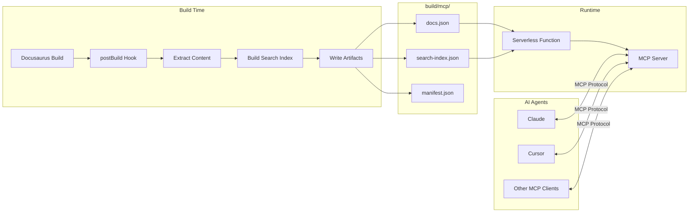

# docusaurus-plugin-mcp-server

A Docusaurus plugin that exposes an [MCP (Model Context Protocol)](https://modelcontextprotocol.io/) server endpoint, allowing AI agents like Claude, Cursor, and other MCP-compatible tools to search and retrieve your documentation.

## Installation

```bash
npm install docusaurus-plugin-mcp-server
```

## Quick Start

### 1. Add the Plugin

```javascript
// docusaurus.config.js
module.exports = {
  plugins: [
    [
      'docusaurus-plugin-mcp-server',
      {
        server: {
          name: 'my-docs',
          version: '1.0.0',
        },
      },
    ],
  ],
};
```

### 2. Create the API Endpoint

Choose your deployment platform:

<details>
<summary><strong>Vercel</strong></summary>

Create `api/mcp.js`:

```javascript
const { createVercelHandler } = require('docusaurus-plugin-mcp-server/adapters');
const path = require('path');

module.exports = createVercelHandler({
  docsPath: path.join(__dirname, '../build/mcp/docs.json'),
  indexPath: path.join(__dirname, '../build/mcp/search-index.json'),
  name: 'my-docs',
  baseUrl: 'https://docs.example.com',
});
```

Add to `vercel.json`:

```json
{
  "functions": {
    "api/mcp.js": {
      "includeFiles": "build/mcp/**"
    }
  },
  "rewrites": [
    { "source": "/mcp", "destination": "/api/mcp" }
  ]
}
```

</details>

<details>
<summary><strong>Netlify</strong></summary>

Create `netlify/functions/mcp.js`:

```javascript
const { createNetlifyHandler } = require('docusaurus-plugin-mcp-server/adapters');
const path = require('path');

exports.handler = createNetlifyHandler({
  docsPath: path.join(__dirname, '../../build/mcp/docs.json'),
  indexPath: path.join(__dirname, '../../build/mcp/search-index.json'),
  name: 'my-docs',
  baseUrl: 'https://docs.example.com',
});
```

Add to `netlify.toml`:

```toml
[build]
  publish = "build"

[functions]
  directory = "netlify/functions"
  included_files = ["build/mcp/**"]

[[redirects]]
  from = "/mcp"
  to = "/.netlify/functions/mcp"
  status = 200
```

</details>

<details>
<summary><strong>Cloudflare Workers</strong></summary>

Cloudflare Workers can't access the filesystem, so you need to import the data directly:

```javascript
import { createCloudflareHandler } from 'docusaurus-plugin-mcp-server/adapters';
import docs from '../build/mcp/docs.json';
import searchIndex from '../build/mcp/search-index.json';

export default {
  fetch: createCloudflareHandler({
    docs,
    searchIndexData: searchIndex,
    name: 'my-docs',
    baseUrl: 'https://docs.example.com',
  }),
};
```

</details>

### 3. Build and Deploy

```bash
npm run build
# Deploy to your platform
```

### 4. Connect Your AI Tool

**Claude Code:**
```bash
claude mcp add --transport http my-docs https://docs.example.com/mcp
```

**Cursor / VS Code:**
```json
{
  "mcpServers": {
    "my-docs": {
      "url": "https://docs.example.com/mcp"
    }
  }
}
```

### 5. Add an Install Button (Optional)

Add a dropdown button to your docs site so users can easily install the MCP server in their AI tool:

```tsx
import { McpInstallButton } from 'docusaurus-plugin-mcp-server/theme';

function NavbarItems() {
  return (
    <McpInstallButton
      serverUrl="https://docs.example.com/mcp"
      serverName="my-docs"
    />
  );
}
```

The button shows a dropdown with copy-to-clipboard configurations for all supported MCP clients (Claude Code, Cursor, VS Code, Windsurf, Claude Desktop).

**Props:**

| Prop | Type | Default | Description |
|------|------|---------|-------------|
| `serverUrl` | `string` | required | Your MCP server endpoint URL |
| `serverName` | `string` | required | Name for the MCP server |
| `label` | `string` | `"Install MCP"` | Button label |
| `className` | `string` | `""` | Optional CSS class |
| `clients` | `ClientId[]` | All HTTP-capable | Which clients to show |

## MCP Tools

The server exposes three tools for AI agents:

### `docs_search`

Search across documentation with relevance ranking.

```json
{
  "name": "docs_search",
  "arguments": {
    "query": "authentication",
    "limit": 5
  }
}
```

| Parameter | Type | Default | Description |
|-----------|------|---------|-------------|
| `query` | `string` | required | Search query |
| `limit` | `number` | `5` | Max results (1-20) |

### `docs_get_page`

Retrieve full page content as markdown.

```json
{
  "name": "docs_get_page",
  "arguments": {
    "route": "/docs/authentication"
  }
}
```

| Parameter | Type | Description |
|-----------|------|-------------|
| `route` | `string` | Page route path |

### `docs_get_section`

Retrieve a specific section by heading ID.

```json
{
  "name": "docs_get_section",
  "arguments": {
    "route": "/docs/authentication",
    "headingId": "oauth-configuration"
  }
}
```

| Parameter | Type | Description |
|-----------|------|-------------|
| `route` | `string` | Page route path |
| `headingId` | `string` | Heading ID to extract |

## Plugin Options

| Option | Type | Default | Description |
|--------|------|---------|-------------|
| `outputDir` | `string` | `'mcp'` | Output directory for MCP artifacts (relative to build dir) |
| `contentSelectors` | `string[]` | `['article', 'main', ...]` | CSS selectors for finding content |
| `excludeSelectors` | `string[]` | `['nav', 'header', ...]` | CSS selectors for elements to remove |
| `minContentLength` | `number` | `50` | Minimum content length to consider a page valid |
| `server.name` | `string` | `'docs-mcp-server'` | Name of the MCP server |
| `server.version` | `string` | `'1.0.0'` | Version of the MCP server |
| `excludeRoutes` | `string[]` | `['/404*', '/search*']` | Routes to exclude (glob patterns) |

### Default Selectors

**Content selectors** (in priority order):
```javascript
['article', 'main', '.main-wrapper', '[role="main"]']
```

**Exclude selectors**:
```javascript
['nav', 'header', 'footer', 'aside', '[role="navigation"]', '[role="banner"]', '[role="contentinfo"]']
```

## Server Configuration

For the runtime adapters:

| Option | Type | Required | Description |
|--------|------|----------|-------------|
| `docsPath` | `string` | Yes* | Path to `docs.json` |
| `indexPath` | `string` | Yes* | Path to `search-index.json` |
| `docs` | `object` | Yes* | Pre-loaded docs (Cloudflare) |
| `searchIndexData` | `object` | Yes* | Pre-loaded search index (Cloudflare) |
| `name` | `string` | Yes | Server name |
| `version` | `string` | No | Server version |
| `baseUrl` | `string` | No | Base URL for full page URLs in responses |

*Use either file paths (Node.js) or pre-loaded data (Workers).

## Testing the Endpoint

```bash
# List available tools
curl -X POST https://docs.example.com/mcp \
  -H "Content-Type: application/json" \
  -d '{"jsonrpc":"2.0","id":1,"method":"tools/list"}'

# Search documentation
curl -X POST https://docs.example.com/mcp \
  -H "Content-Type: application/json" \
  -d '{
    "jsonrpc":"2.0",
    "id":2,
    "method":"tools/call",
    "params":{
      "name":"docs_search",
      "arguments":{"query":"getting started"}
    }
  }'
```

## How It Works



The plugin operates in two phases:

**Build Time:** During `docusaurus build`, the plugin's `postBuild` hook processes all rendered HTML pages, extracts content, converts to markdown, builds a FlexSearch index, and outputs artifacts to `build/mcp/`.

**Runtime:** A serverless function loads the pre-built artifacts and handles MCP JSON-RPC requests from AI agents. The server is stateless and fast since all indexing happens at build time.

## Features

- **Full-text Search** - FlexSearch-powered search with relevance ranking
- **Page Retrieval** - Get complete page content as clean markdown
- **Section Extraction** - Retrieve specific sections by heading ID
- **Platform Adapters** - Pre-built adapters for Vercel, Netlify, and Cloudflare Workers
- **Build-time Processing** - Extracts content from rendered HTML, capturing React component output
- **Zero Runtime Docusaurus Dependency** - The MCP server runs independently

## Local Development

Run a local HTTP server for testing:

```javascript
// mcp-server.mjs
import http from 'http';
import { McpDocsServer } from 'docusaurus-plugin-mcp-server';
import path from 'path';
import { fileURLToPath } from 'url';

const __dirname = path.dirname(fileURLToPath(import.meta.url));

const server = new McpDocsServer({
  docsPath: path.join(__dirname, 'build/mcp/docs.json'),
  indexPath: path.join(__dirname, 'build/mcp/search-index.json'),
  name: 'my-docs',
  baseUrl: 'http://localhost:3000',
});

http.createServer(async (req, res) => {
  if (req.method !== 'POST') {
    res.writeHead(405);
    res.end();
    return;
  }

  let body = '';
  req.on('data', (chunk) => (body += chunk));
  req.on('end', async () => {
    const response = await server.handleRequest(JSON.parse(body));
    res.writeHead(200, { 'Content-Type': 'application/json' });
    res.end(JSON.stringify(response));
  });
}).listen(3456, () => {
  console.log('MCP server at http://localhost:3456');
});
```

Connect Claude Code:
```bash
claude mcp add --transport http my-docs http://localhost:3456
```

## API Reference

### Main Exports

```javascript
import {
  // Docusaurus plugin (default export)
  mcpServerPlugin,

  // MCP Server class
  McpDocsServer,

  // Tool definitions
  docsSearchTool,
  docsGetPageTool,
  docsGetSectionTool,

  // Utilities
  htmlToMarkdown,
  extractContent,
  extractHeadingsFromMarkdown,
  buildSearchIndex,

  // Default options
  DEFAULT_OPTIONS,
} from 'docusaurus-plugin-mcp-server';
```

### Adapter Exports

```javascript
import {
  createVercelHandler,
  createNetlifyHandler,
  createCloudflareHandler,
  generateAdapterFiles,
} from 'docusaurus-plugin-mcp-server/adapters';
```

### Theme Exports

```tsx
import {
  McpInstallButton,
  type McpInstallButtonProps,
} from 'docusaurus-plugin-mcp-server/theme';
```

## Requirements

- Node.js >= 18
- Docusaurus 3.x

## License

MIT
