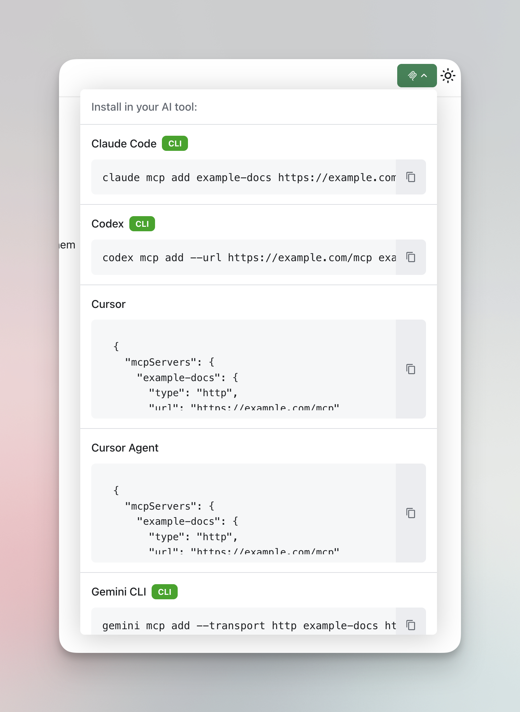
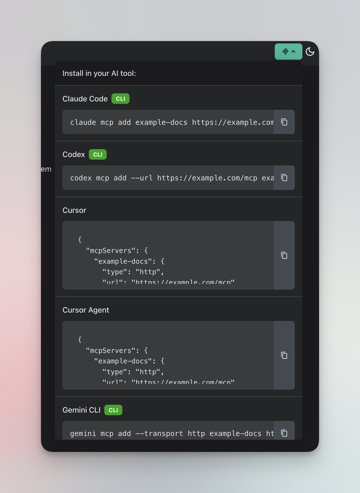
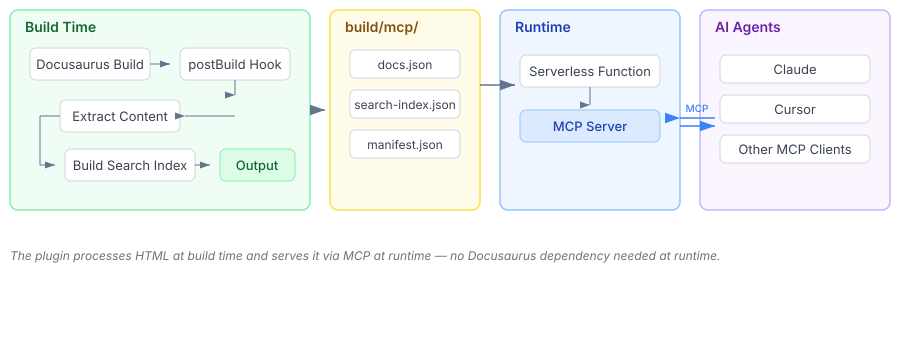

# docusaurus-plugin-mcp-server


[](https://badge.fury.io/js/docusaurus-plugin-mcp-server)
[](https://github.com/scalvert/docusaurus-plugin-mcp-server/blob/main/LICENSE)

A Docusaurus plugin that exposes an [MCP (Model Context Protocol)](https://modelcontextprotocol.io/) server endpoint, allowing AI agents like Claude, Cursor, and other MCP-compatible tools to search and retrieve your documentation.

The server speaks MCP [2026-07-28](https://modelcontextprotocol.io/specification/2026-07-28) and still serves clients on 2025-era revisions (the `initialize` handshake) from the same endpoint. It can also serve [Agent Skills](#serving-agent-skills-over-mcp) that teach agents how to use your docs tools.

> Upgrading from 1.x? See [Upgrading to 2.0](#upgrading-to-20).

## Installation

```bash
npm install docusaurus-plugin-mcp-server
```

## Quick Start

### 1. Add the Plugin

```javascript snippet=readme/snippet-01.js
// docusaurus.config.js
module.exports = {
  plugins: [
    [
      'docusaurus-plugin-mcp-server',
      {
        server: {
          name: 'my-docs',
          version: '1.0.0',
        },
      },
    ],
  ],
};
```

### 2. Create the API Endpoint

The MCP server runs on any web-standard serverless or edge runtime — Cloudflare Workers, modern Netlify functions, Vercel Edge, Deno, Bun. Import the artifact bundle the build writes (`build/mcp/bundle.json`) and pass it to `createWebRequestHandler`, which returns a standard `(request: Request) => Promise<Response>`. (These runtimes can't read the filesystem, so the bundle is imported as a module rather than loaded from disk.)

```javascript snippet=readme/snippet-06.js
import { createWebRequestHandler } from 'docusaurus-plugin-mcp-server/adapters';
import bundle from '../build/mcp/bundle.json';

export default {
  // Name, version, and site URL come from the build; pass them here to override.
  fetch: createWebRequestHandler({ artifacts: bundle }),
};
```

The bundle holds the documents, the search index, and the [skills](#serving-agent-skills-over-mcp) (when enabled), so there's nothing else to wire up. A stale or malformed bundle fails with a message saying how to fix it, both on requests and on `GET` (the status endpoint).

The `export default { fetch }` form works on Cloudflare Workers, Deno, and Bun. Other runtimes use their own entry convention (e.g. modern Netlify functions `export default async (request) => Response`) — the handler is identical, only the export wrapper differs.

The handler is unauthenticated and allows all origins (`Access-Control-Allow-Origin: *`) by default, since a docs MCP endpoint is meant to be public — pass `corsOrigin` to restrict it.

For local development, run the server over Node's `http` with `createNodeServer` from `docusaurus-plugin-mcp-server/adapters/node` (see [Adapter Exports](#adapter-exports)).

### 3. Build and Deploy

```bash
npm run build
# Deploy to your platform
```

### 4. Connect Your AI Tool

**Claude Code:**

```bash
claude mcp add --transport http my-docs https://docs.example.com/mcp
```

**Cursor / VS Code:**

```json snippet=readme/snippet-07.json
{
  "mcpServers": {
    "my-docs": {
      "url": "https://docs.example.com/mcp"
    }
  }
}
```

### 5. Add an Install Button (Optional)

Add a dropdown button to your docs site so users can easily install the MCP server in their AI tool:

```tsx snippet=readme/snippet-08.tsx
import { McpInstallButton } from 'docusaurus-plugin-mcp-server/theme';

function NavbarItems() {
  return <McpInstallButton serverUrl="https://docs.example.com/mcp" serverName="my-docs" />;
}
```

The button shows a dropdown with copy-to-clipboard configurations for all supported MCP clients.

| Light Mode | Dark Mode |
|:----------:|:---------:|
|  |  |

**Props:**

| Prop | Type | Default | Description |
|------|------|---------|-------------|
| `serverUrl` | `string` | (plugin config) | MCP server endpoint URL. Falls back to the plugin's global data when omitted |
| `serverName` | `string` | (plugin config) | MCP server name. Falls back to the plugin's global data when omitted |
| `label` | `string` | (none) | Button label. If omitted, shows only the MCP icon |
| `headerText` | `string` | `"Choose your AI tool:"` | Text shown at the top of the dropdown |
| `className` | `string` | `""` | Optional CSS class |
| `clients` | `ClientId[]` | All HTTP-capable | Which clients to show |

## MCP Tools

The server exposes two tools for AI agents:

### `docs_search`

Search across documentation with relevance ranking. Returns matching documents, best first, with URLs, snippets, and matching sections. See [Search](#search) for how results are ranked.

```json snippet=readme/snippet-09.json
{
  "name": "docs_search",
  "arguments": {
    "query": "authentication",
    "limit": 16
  }
}
```

| Parameter | Type | Default | Description |
|-----------|------|---------|-------------|
| `query` | `string` | required | Search query, up to 500 characters. Only the first 16 distinct terms are searched. |
| `limit` | `number` | `16` | Max results (1-20) |

**Response includes:**

- Full URL for each result (use with `docs_fetch`)
- Title and relevance score
- Snippet of matching content
- Matching headings

### `docs_fetch`

Retrieve full page content as markdown. Use this after searching to get the complete content of a specific page.

```json snippet=readme/snippet-10.json
{
  "name": "docs_fetch",
  "arguments": {
    "url": "https://docs.example.com/docs/authentication"
  }
}
```

| Parameter | Type | Description |
|-----------|------|-------------|
| `url` | `string` | Full URL of the page (from search results) |

**Response includes:**

- Page title and description
- Table of contents with anchor links
- Full markdown content

## Serving Agent Skills over MCP

Tool descriptions tell an agent what `docs_search` and `docs_fetch` do, not how to research your docs well. The server can also ship that guidance as [Agent Skills](https://agentskills.io) via the MCP skills extension ([SEP-2640](https://modelcontextprotocol.io/seps/2640-skills-extension), `io.modelcontextprotocol/skills`).

By default the plugin packages one built-in skill, `docs-research`, which covers the search → fetch → cite workflow for your site. It's generated from your site at build time:

- Its description names your docs, host, and `tagline`, e.g. "Answer questions using the Acme documentation at acme.dev (Build faster)". Agents read the description to decide when to load the skill.
- A **Where things are** section groups the indexed pages by URL path, largest sections first. Each section lists its page count, a link to its overview page if there is one, and a few example page titles. It's left out when the pages don't form at least two multi-page sections.

The built-in skill is generic by design. For a skill that knows your product (its terminology, where each topic lives, the questions people actually ask), **write your own `docs-research` skill: it replaces the built-in one.** Start from a copy of [`skills-builtin/docs-research/`](skills-builtin/docs-research/SKILL.md).

Add your own skills (a directory per skill with a `SKILL.md` at its root) and point the plugin at them:

```javascript snippet=readme/snippet-20.js
// docusaurus.config.js
module.exports = {
  plugins: [
    [
      'docusaurus-plugin-mcp-server',
      {
        server: { name: 'my-docs' },
        // Serve the built-in docs-research skill plus every skill in ./mcp-skills
        skills: { dir: 'mcp-skills' },
      },
    ],
  ],
};
```

```text
mcp-skills/
└── api-migration/
    ├── SKILL.md            # YAML frontmatter with name + description, then instructions
    └── references/
        └── v1-to-v2.md
```

At build time the plugin validates every skill (frontmatter `name` must match the directory name; at most 512 files and 16 MiB per skill), precomputes SHA-256 digests, and writes `build/mcp/skills.json`. Invalid skills fail the build with a `SkillValidationError`. Symlinks inside a skill are skipped, and bundled scripts (`.sh`, `.py`, `.js`, ...) are packaged with a warning. The skills are part of the artifact bundle, so the handler serves them with no extra config. An author skill named `docs-research` replaces the built-in one. If you copy the built-in skill, replace its placeholders (`{{siteDocs}}`, `{{siteSummary}}`, `{{siteMap}}`) with your own wording: they're only filled in for the built-in copy. Set `skills: { builtin: false, dir: '...' }` to ship only your own, or `skills: false` to turn skills off.

At runtime the server:

- declares the `io.modelcontextprotocol/skills` extension and implements `skills/list` and `skills/get`
- serves every skill file as a resource at `skill://<name>/<path>` (for example `skill://docs-research/SKILL.md`)
- appends the skill URIs to the server `instructions`, so clients that don't support the extension yet can still find the skills and load them with `resources/read`

Keep skills to markdown. MCP hosts treat served skills as untrusted input and won't run bundled scripts without explicit user approval.

## Plugin Options

| Option | Type | Default | Description |
|--------|------|---------|-------------|
| `outputDir` | `string` | `'mcp'` | Output directory for MCP artifacts (relative to build dir) |
| `contentSelectors` | `string[]` | `['article', 'main', ...]` | CSS selectors for finding content |
| `excludeSelectors` | `string[]` | `['nav', 'header', ...]` | CSS selectors for elements to remove |
| `minContentLength` | `number` | `50` | Minimum content length to consider a page valid |
| `server.name` | `string` | `'docs-mcp-server'` | Name of the MCP server |
| `server.version` | `string` | `'1.0.0'` | Version of the MCP server |
| `server.url` | `string` | (derived) | Explicit MCP HTTP endpoint URL for the install button |
| `server.urlBase` | `'origin' \| 'site'` | `'origin'` | How to derive the MCP URL when `server.url` is not set. `'origin'` → `{siteUrl}/{outputDir}`; `'site'` → under Docusaurus `baseUrl` |
| `excludeRoutes` | `string[]` | `['/404*', '/search*']` | Routes to exclude (glob patterns) |
| `indexers` | `string[] \| false` | `['local']` | Indexers to run during build. Use `false` to disable. Supports built-in (`'local'`), relative paths, or npm packages. |
| `search` | `string` | `'local'` | Search provider module for runtime queries. Supports built-in (`'local'`), relative paths, or npm packages. |
| `skills` | `{ builtin?: boolean; dir?: string } \| false` | built-in skill only | [Agent Skills](#serving-agent-skills-over-mcp) to package into `skills.json`. `dir` is relative to the site directory. `false` disables skills. |

Build-time options control artifact generation and the install-button URL (`server.url` / `server.urlBase`). Runtime-only options such as `instructions`, `tools`, and `baseUrl` belong on the adapter/handler config — see [Server Configuration](#server-configuration).

### Default Selectors

**Content selectors** (in priority order):

```javascript snippet=readme/snippet-11.js
['article', 'main', '.main-wrapper', '[role="main"]'];
```

**Exclude selectors**:

```javascript snippet=readme/snippet-12.js
[
  'nav',
  'header',
  'footer',
  'aside',
  '[role="navigation"]',
  '[role="banner"]',
  '[role="contentinfo"]',
];
```

## Search

The built-in `'local'` search needs no external service. At build time it adds a search index to the artifact bundle; at runtime `docs_search` answers from it.

Results are ranked with [BM25+](https://en.wikipedia.org/wiki/Okapi_BM25) over each page's title, route, headings, description, and body:

- **Query words are combined with OR.** A page does not need every word in the query to match; pages with more of the words, rarer words, or matches in more important fields rank higher.
- **The route is indexed.** `/docs/errors/expired-cursor` matches "expired cursor" even if the title says something else.
- **Long pages are not favored.** Scores are normalized by field length, so a changelog that mentions every topic does not outrank the page about the topic.
- **Words are stemmed, accents are folded, and common words are ignored.** A Porter stemmer makes "indexing" match "index" and "route" match "routes"; "deploiement" matches "déploiement"; and "how do I" adds nothing to a query. Words of three or more letters also match as prefixes, so "auth" finds "authentication".

Tokenization and stemming are fixed, so the index built at `docusaurus build` always matches the one queried at runtime. Field boosts apply at query time and can be changed on the server config without a rebuild:

```javascript snippet=readme/snippet-21.js
createWebRequestHandler({
  artifacts: bundle,
  // Defaults: title 3, slug 3, headings 2, description 1.5, content 1
  localSearch: { fieldBoosts: { headings: 3 } },
});
```

The built-in search is tuned for English. For other languages, or to use a hosted search service, write a [custom search provider](#searchprovider).

### Measuring search quality

`evaluateSearch` runs labeled queries against any search provider and reports how often the right page comes back near the top. Use it to compare providers, or to guard ranking in CI after `docusaurus build`. It is **experimental**: its options and report shape may change in a 2.x minor release.

```javascript snippet=readme/snippet-22.js
import { loadSearchProvider, evaluateSearch } from 'docusaurus-plugin-mcp-server';
import { readArtifactBundle } from 'docusaurus-plugin-mcp-server/adapters/node';

const provider = await loadSearchProvider('local');
await provider.initialize(
  { baseUrl: 'https://docs.example.com', serverName: 'eval', serverVersion: '0', outputDir: '' },
  { bundle: await readArtifactBundle('build/mcp') }
);

const report = await evaluateSearch(provider, [
  { query: 'install the CLI', expected: ['/docs/installation'] },
  { query: 'rotate an API token', expected: ['/docs/auth/tokens', '/docs/auth/rotation'] },
]);

console.log(report.hitsAt[3], '/', report.total, 'in the top 3; MRR', report.mrr.toFixed(2));
```

`expected` lists every page that fully answers the query, as routes or full URLs. `hitsAt[k]` counts queries whose first correct page ranked at or above `k` (defaults: 1, 3, 5), and `mrr` is the mean reciprocal rank of that page (1.0 means it was always first). `report.cases` has each query's rank and returned routes, for finding the misses.

## Custom Providers

The plugin uses a two-phase provider model: **indexers** run at build time to process documents, and **search providers** handle queries at runtime. Both are pluggable.

### ContentIndexer

Implement `ContentIndexer` to push documents to an external system during build:

```typescript snippet=readme/snippet-13.ts
import type { ContentIndexer, ProviderContext, ProcessedDoc } from 'docusaurus-plugin-mcp-server';

export default class AlgoliaIndexer implements ContentIndexer {
  readonly name = 'algolia';

  shouldRun(): boolean {
    return process.env.ALGOLIA_SYNC === 'true';
  }

  async initialize(context: ProviderContext): Promise<void> {
    console.log(`[Algolia] Initializing for ${context.baseUrl}`);
  }

  async indexDocuments(docs: ProcessedDoc[]): Promise<void> {
    // Push docs to Algolia
  }

  async finalize(): Promise<Map<string, unknown>> {
    // No local artifacts needed
    return new Map();
  }
}
```

The plugin always writes the documents (`docs.json`) itself, whichever indexers run. What `finalize()` returns is added to the artifact bundle:

- `search-index.json` becomes the bundle's search index. Only one indexer may return it.
- `bundle.json`, `manifest.json`, and `skills.json` are written by the plugin; returning one fails the build.
- Any other filename (a relative path inside the output directory) is kept as an indexer extra and written to `build/mcp/`.
- `getManifestData()`, if implemented, is recorded in `manifest.json` under `indexerData.<name>`.

### SearchProvider

Implement `SearchProvider` to delegate runtime search to an external service:

```typescript snippet=readme/snippet-14.ts
import type {
  SearchProvider,
  ProviderContext,
  SearchOptions,
  SearchResult,
} from 'docusaurus-plugin-mcp-server';

export default class GleanSearchProvider implements SearchProvider {
  readonly name = 'glean';

  private apiEndpoint = process.env.GLEAN_API_ENDPOINT!;
  private apiToken = process.env.GLEAN_API_TOKEN!;

  async initialize(context: ProviderContext): Promise<void> {
    if (!this.apiEndpoint || !this.apiToken) {
      throw new Error('GLEAN_API_ENDPOINT and GLEAN_API_TOKEN required');
    }
  }

  isReady(): boolean {
    return !!this.apiEndpoint && !!this.apiToken;
  }

  async search(query: string, options?: SearchOptions): Promise<SearchResult[]> {
    // Call Glean Search API and transform results
    return [];
  }
}
```

With an `artifacts` or `artifactsDir` server config, `initialize` receives the artifact bundle as `initData.bundle`: the documents, the search index (if an indexer produced one), and any indexer extras. So a provider can read what its indexer wrote without touching the filesystem. (With the deprecated configs it gets the same `initData` as in 2.1.) `getDocument` and `getDocCount` are optional: without them, `docs_fetch` and the status endpoint use the bundle's documents.

### Configuring Custom Providers

```javascript snippet=readme/snippet-15.js
// docusaurus.config.js: build time
module.exports = {
  plugins: [
    [
      'docusaurus-plugin-mcp-server',
      {
        // Run both the built-in local search indexer and a custom one
        indexers: ['local', './my-algolia-indexer.js'],
      },
    ],
  ],
};

// worker.js: runtime. The search provider is chosen where the server runs.
import GleanSearchProvider from '@myorg/glean-search';

createWebRequestHandler({ artifacts: bundle, search: new GleanSearchProvider() });
```

## Server Configuration

These options apply to `McpDocsServer`, `createWebRequestHandler`, `createNodeServer`, and `createNodeHandler`: where the MCP server actually runs. They are **not** `McpServerPluginOptions`; the Docusaurus plugin only builds the artifact bundle.

| Option | Type | Required | Description |
|--------|------|----------|-------------|
| `artifacts` | `object` | Yes* | The artifact bundle: the contents of `build/mcp/bundle.json` |
| `artifactsDir` | `string` | Yes* | Directory holding the bundle, e.g. `./build/mcp` (`createNodeServer`/`createNodeHandler` only) |
| `name` | `string` | No | Server name. Default: the plugin's `server.name` from the build |
| `version` | `string` | No | Server version. Default: the plugin's `server.version` from the build |
| `baseUrl` | `string` | No | Base URL for full page URLs in responses. Default: the site URL from the build |
| `instructions` | `string` | No | Instructions describing how to use the server, surfaced to MCP clients in the `server/discover` (2026-07-28) or `initialize` (2025-era) result. When skills are served, their URIs are appended |
| `tools` | `object` | No | Per-tool overrides. Supports `docs_search.description` and `docs_fetch.description` to customize tool descriptions |
| `search` | `string \| SearchProvider` | No | Search provider. Default: the built-in `'local'` search |
| `localSearch` | `{ fieldBoosts?: {...} }` | No | Field boosts for the built-in search. See [Search](#search) |

\*Pass `artifacts` (edge and serverless, or `McpDocsServer` directly) or `artifactsDir` (Node). In Node, `readArtifactBundle(dir)` from `docusaurus-plugin-mcp-server/adapters/node` gives you the `artifacts` value.

The 2.0/2.1 configs (`docsPath`/`indexPath`/`skillsPath`, or `docs`/`searchIndexData`/`skills` with a required `name`) still work through 2.x, but are deprecated and will be removed in 3.0.

Example with extended configuration:

```javascript
export default {
  fetch: createWebRequestHandler({
    artifacts: bundle,
    instructions: 'Search the Acme product docs. Use docs_search to find pages, then docs_fetch for full content.',
    tools: {
      docs_search: { description: 'Search the Acme product documentation.' },
      docs_fetch: { description: 'Fetch the full markdown of an Acme docs page.' },
    },
  }),
};
```

## Verifying Your Build

After running `npm run build`, use the included CLI to verify the MCP output:

```bash
npx docusaurus-mcp-verify
```

This checks that:

- The artifact bundle reads and validates (`bundle.json`, or the per-file layout from 2.0/2.1 builds, with a warning)
- It has a search index for the built-in local search
- The MCP server can initialize and load the content

You can specify a custom build directory, and pass `--output-dir` if you changed the plugin's `outputDir` option:

```bash
npx docusaurus-mcp-verify ./custom-build
npx docusaurus-mcp-verify ./custom-build --output-dir agents/mcp
```

Example output:

```sh
🔍 MCP Build Verification
==================================================
Build directory: /path/to/your/project/build
MCP directory:   /path/to/your/project/build/mcp

📁 Checking build output...
   ✓ Found 42 documents
   ✓ Artifact bundle is valid

🚀 Testing MCP server...
   ✓ Server "my-docs" initialized with 42 documents

✅ All checks passed!
```

## Testing the Endpoint

The easiest way to test your MCP server is with the official MCP Inspector:

```bash
npx @modelcontextprotocol/inspector
```

This opens a visual interface where you can:

- Connect to your server URL
- Browse available tools
- Execute tool calls interactively
- View responses in a formatted display

Alternatively, test with curl:

```bash
# List available tools
curl -X POST https://docs.example.com/mcp \
  -H "Content-Type: application/json" \
  -H "Accept: application/json, text/event-stream" \
  -d '{"jsonrpc":"2.0","id":1,"method":"tools/list"}'

# Search documentation
curl -X POST https://docs.example.com/mcp \
  -H "Content-Type: application/json" \
  -H "Accept: application/json, text/event-stream" \
  -d '{
    "jsonrpc":"2.0",
    "id":2,
    "method":"tools/call",
    "params":{
      "name":"docs_search",
      "arguments":{"query":"getting started"}
    }
  }'
```

## How It Works



The plugin operates in two phases:

**Build Time:** During `docusaurus build`, the plugin's `postBuild` hook processes all rendered HTML pages, extracts content, converts to markdown, builds a search index, and writes the artifact bundle to `build/mcp/bundle.json`. Through 2.x it also writes each part as its own file (`docs.json`, `search-index.json`, `skills.json`, `manifest.json`) for existing deployments.

**Runtime:** A serverless function loads the pre-built artifacts and handles MCP JSON-RPC requests from AI agents. The server is stateless (MCP 2026-07-28 has no sessions), so any instance can answer any request, and list/read results carry cache hints (`ttlMs` 5 minutes, `cacheScope: public`) because content only changes on redeploy. All indexing happens at build time.

## Features

- **Full-text Search** - BM25-ranked local search, with no external service
- **Page Retrieval** - Get complete page content as clean markdown
- **MCP 2026-07-28, backward compatible** - Stateless modern protocol plus 2025-era clients on the same endpoint
- **Agent Skills** - Ships a docs-research skill (and yours) over the MCP skills extension
- **Runs Anywhere** - One web-standard handler (`createWebRequestHandler`) for any serverless/edge runtime — Cloudflare Workers, modern Netlify functions, Vercel Edge, Deno, Bun — plus a Node server (`createNodeServer`) for local development
- **CORS Support** - The web and Node handlers send CORS headers for browser-based clients; restrict with `corsOrigin`
- **Build-time Processing** - Extracts content from rendered HTML, capturing React component output
- **Zero Runtime Docusaurus Dependency** - The MCP server runs independently

## Local Development

Run a local MCP server for testing using the built-in Node adapter:

```javascript snippet=readme/snippet-16.js
// mcp-server.mjs
import { createNodeServer } from 'docusaurus-plugin-mcp-server/adapters/node';

createNodeServer({
  artifactsDir: './build/mcp',
  baseUrl: 'http://localhost:3000',
}).listen(3456, () => {
  console.log('MCP server at http://localhost:3456');
});
```

The Node adapter handles CORS, preflight requests, and health checks (GET) automatically.

Connect Claude Code:

```bash
claude mcp add --transport http my-docs http://localhost:3456
```

## API Reference

### Main Exports

```javascript snippet=readme/snippet-17.js
import {
  // Docusaurus plugin (also the default export)
  mcpServerPlugin,

  // MCP server class (advanced / custom runtimes)
  McpDocsServer,

  // Tool definitions
  docsSearchTool,
  docsFetchTool,

  // Provider loaders (built-in 'local' or custom indexers/providers)
  loadIndexer,
  loadSearchProvider,

  // The built-in local search, for passing an instance as `search`
  LocalSearchIndexer,
  LocalSearchProvider,

  // Measure how well a search provider ranks the right pages (experimental)
  evaluateSearch,

  // Resolve the MCP endpoint URL the install button uses
  resolveServerUrl,

  // Package Agent Skills into a skills.json artifact outside the plugin (experimental)
  buildSkillsArtifact,

  // Default plugin options
  DEFAULT_PLUGIN_OPTIONS,
} from 'docusaurus-plugin-mcp-server';
```

### `resolveServerUrl`

Derives the public MCP HTTP endpoint URL — the same logic the plugin uses for the install button and `globalData`. Use this when building custom theme UI that must stay in sync with plugin URL resolution.

Types `ResolveServerUrlInput` and `ServerUrlBase` are also exported from `.`.

```typescript
import { resolveServerUrl, type ResolveServerUrlInput } from 'docusaurus-plugin-mcp-server';

const serverUrl = resolveServerUrl({
  siteUrl: 'https://docs.example.com',
  baseUrl: '/docs/',
  outputDir: 'mcp',
  server: { urlBase: 'site' },
});
// → 'https://docs.example.com/docs/mcp'
```

| Field | Type | Description |
|-------|------|-------------|
| `siteUrl` | `string` | Docusaurus `siteConfig.url` |
| `baseUrl` | `string` | Docusaurus `siteConfig.baseUrl` |
| `outputDir` | `string` | Plugin `outputDir` (default `'mcp'`) |
| `server.url` | `string` | Explicit endpoint; when set, `urlBase` is ignored |
| `server.urlBase` | `ServerUrlBase` | `'origin'` (default) → `{siteUrl}/{outputDir}`; `'site'` → under `baseUrl` |

`ServerUrlBase` is `'origin' | 'site'`. Mirrors the `server.url` / `server.urlBase` plugin options.

### Adapter Exports

```javascript snippet=readme/snippet-18.js
import { createWebRequestHandler } from 'docusaurus-plugin-mcp-server/adapters';
import {
  createNodeServer,
  createNodeHandler,
  readArtifactBundle,
} from 'docusaurus-plugin-mcp-server/adapters/node';
```

- `createNodeServer(options)` — Creates a complete Node.js HTTP server for local development. Returns an `http.Server` ready to `.listen()`.
- `createNodeHandler(options)` — Creates a request handler function compatible with `http.createServer()`. Use this when you need to integrate with an existing server.
- `readArtifactBundle(dir)` — Reads and validates the artifact bundle in a build directory (`bundle.json`, or the 2.0/2.1 per-file layout). Pass the result as `artifacts` to `McpDocsServer`, or as `initData.bundle` to a search provider you drive yourself.

The `ArtifactBundle` type is exported from all three entry points.

### Theme Exports

```tsx snippet=readme/snippet-19.tsx
import {
  McpInstallButton,
  type McpInstallButtonProps,
  useMcpRegistry,
  createDocsRegistry,
  createDocsRegistryOptions,
  type McpConfig,
} from 'docusaurus-plugin-mcp-server/theme';
```

- `McpInstallButton` — Dropdown button for users to install the MCP server in their AI tool.
- `useMcpRegistry()` — React hook that returns the MCP config registry from plugin global data. Returns `undefined` if the plugin is not installed.
- `createDocsRegistry(config)` — Creates a pre-configured `MCPConfigRegistry` for documentation servers.
- `createDocsRegistryOptions(config)` — Returns registry options without creating the registry.
- `McpConfig` — Type for `{ serverUrl: string; serverName: string }`.

## Moving off the deprecated server configs (2.2)

2.2 changes nothing you have to act on. It adds `build/mcp/bundle.json` and the `artifacts` / `artifactsDir` server options, and deprecates the file (`docsPath`, `indexPath`, `skillsPath`) and pre-loaded data (`docs`, `searchIndexData`, `skills`) configs. Those still work through 2.x and are removed in 3.0. [migrations/2.x-3.0.0.md](migrations/2.x-3.0.0.md) has the before/after code and a checklist for an agent to run.

## Upgrading to 2.0

**Follow [migrations/1.x-2.0.0.md](migrations/1.x-2.0.0.md).** It lists every breaking change with before/after code, and ends with a checklist an AI agent can run to migrate a project. Errors thrown for 1.x configuration link to it.

In short:

- **Requirements:** Node.js >= 22 and zod >= 4.2.
- **Rebuild and redeploy `build/mcp/`.** The `search-index.json` format changed, and a 1.x index is rejected with a message saying to rebuild. Deployment problems like this are `ConfigurationError`s: their message, which says how to fix them, is returned to clients and in the `GET` status. Other errors are still reported only as `Internal server error`.
- **FlexSearch is replaced by the built-in `local` BM25 search.** Remove `flexsearch` options and `flexsearch` values. Tune ranking at runtime with `localSearch.fieldBoosts`. Search now matches any of the query words (OR) instead of all of them, and `query` is capped at 500 characters.
- **`docsSearchTool.inputSchema` / `docsFetchTool.inputSchema` are `z.object(...)` schemas.** The raw shapes are still exported as `docsSearchInputSchema` / `docsFetchInputSchema`.
- **Unknown tools return JSON-RPC `-32602`** instead of an `isError` result.
- **Skills:** the build writes `build/mcp/skills.json`. Pass it to your handler to serve it, or set `skills: false`.

**MCP clients need no changes.** 2026-07-28 and 2025-era clients are served from the same endpoint, and the guide lists the small response differences older clients see.

## Requirements

- Node.js >= 22
- Docusaurus 3.x
- zod >= 4.2

## License

MIT

<!-- configure-agents:skills start -->

## Agent skills

This repository ships agent skill(s) under `skills/`. Install them into your
AI agent with [`npx skills`](https://github.com/agentskills/agentskills):

```sh
npx skills add -g scalvert/docusaurus-plugin-mcp-server   # global — available in every repo
npx skills add scalvert/docusaurus-plugin-mcp-server      # or scoped to the current repo
```

<!-- configure-agents:skills end -->
